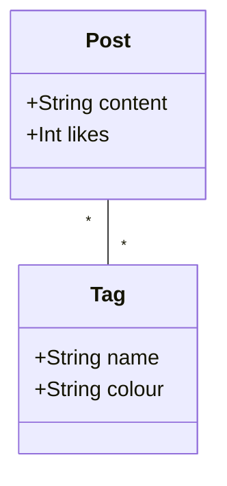

# Notes

Here, we'll keep track of the outcomes of our discussions:

## Version control

### Naming branches

The primary branch should be named `main` not `master`. When apprentices are installing git, there is an option for this which they should select.

If a branch is named `master`,
 - go to github.com
 - click branches
 - click the :pencil: next to the branch to be renamed
 - rename it

Then, to rename the branch locally and link it to the remote, run these commands
```
git branch -m master main
git fetch origin
git branch -u origin/main main
git remote set-head origin -a
```

### Branches and flow

The preferred git flow is to have
```
main -> development -> feature
```
When adding a new feature, we
 1. create a branch for that feature.
 2. PR into `development` in order to run tests, linting and code review (this could also deploy to a staging environment)
 3. PR into main in order to deploy

This is a realistic work flow which demonstrates the purpose of having branches more saliently than simply `main -> feature`. It allows us to talk about CI/CD when we introduce testing.

## Specification and design

### Class diagrams

It is worthwhile making it clear that class diagrams aren't necessarily a 1:1 map of "things with the `class` keyword" in your project. It creates problems when we reach database week, and we're writing database models rather than classes. Apprentices then feel like class diagrams don't apply.



This models the structure of our data in the sense that it outlines the relationships between different parts of the system, even if those parts aren't being represented by `class Post {}` in our code. To support this, we should keep using class diagrams regularly throughout our work once they have been introduced.
