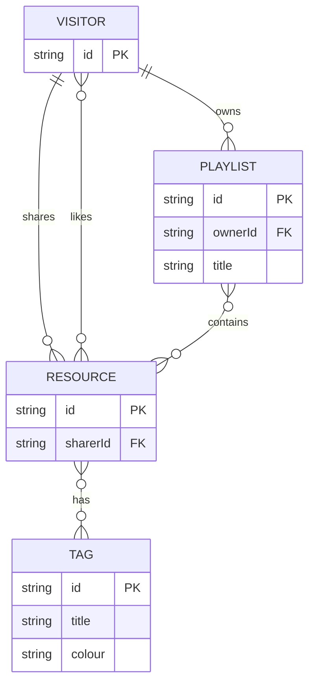

# SWE Tube

## User story

**Visitors** are anonymous. When we add auth later, we can allow them to create a user account which persists their profile in the `User` table

 - As a visitors, I can see a list of all previously shared **resources**
 - As a visitor, I can filter the list by **tags**
 - As a visitor, I can mark a resource as **liked**
 - As a visitor, I can mark a resource as **completed**
 - As a visitor, I can order the filtered list by _number of likes_ or _time posted_
 - As a visitor, I can create a **playlist** and add resources to it

## ERD

